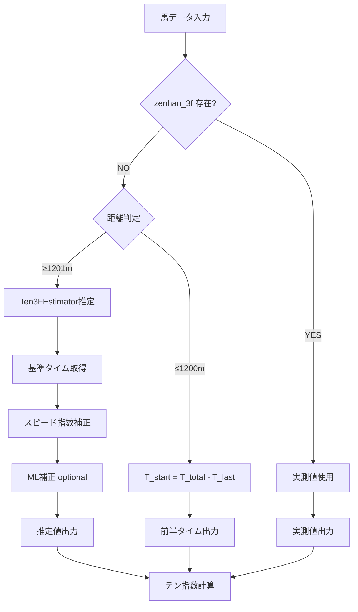

# 前半3Fタイム計算方法の定義書

**作成日**: 2026-01-10  
**作成者**: Enable CEO & AI戦略家（CSO兼クリエイティブディレクター）  
**プロジェクト**: 地方競馬AI予想システム（HQS指数計算エンジン）

---

## 📋 目次

1. [概要](#概要)
2. [前半3Fタイムの3つの計算方法](#前半3fタイムの3つの計算方法)
3. [実装仕様](#実装仕様)
4. [使用例](#使用例)
5. [技術的詳細](#技術的詳細)

---

## 概要

地方競馬AI予想システムにおいて、**前半3Fタイム**は以下の3つの状況で計算方法が異なります：

1. **正規の前半3Fタイム**（実測値）: データベースに記録されている実走タイム
2. **推定前半3Fタイム**（1201m以上）: 欠損時に Ten3FEstimator で推定
3. **1200m以下の前半タイム**: `T_start = T_total - T_last` で計算（1F/2Fタイムも含む）

---

## 前半3Fタイムの3つの計算方法

### 1️⃣ 正規の前半3Fタイム（実測値）

**定義**: 
- データベースの `zenhan_3f` カラムに記録されている実走タイム
- 地方競馬公式データから取得

**適用条件**:
- `zenhan_3f` が存在する（NULL でない）
- `zenhan_3f > 0.0` である

**データ形式**:
- 単位: 秒（例: 35.8秒）
- データベースでは 10倍の整数値で保存（例: 358 → 35.8秒）

**実装**:
```python
# index_calculator.py (678行)
zenhan_3f_raw = safe_float(horse_data.get('zenhan_3f')) / 10.0 if horse_data.get('zenhan_3f') else 0.0

# 実測値がある場合
if zenhan_3f_raw > 0.0:
    zenhan_3f = zenhan_3f_raw
    ten_3f_method = 'actual'  # 実測値使用
```

**使用例**:
```python
horse_data = {
    'zenhan_3f': 358,  # 35.8秒（実測値）
    'kyori': 1600,
    'keibajo_code': '30'  # 門別
}

# 結果: zenhan_3f = 35.8秒（実測値）
```

---

### 2️⃣ 推定前半3Fタイム（1201m以上）

**定義**:
- `zenhan_3f` が欠損している場合、**Ten3FEstimator** で推定
- 距離 **1201m以上** の場合に適用

**適用条件**:
- `zenhan_3f_raw is None or zenhan_3f_raw == 0.0`
- `kyori >= 1201`

**計算方法** (Ten3FEstimator.estimate_baseline):

#### **ステップ1: 基準タイム取得（クラス別）**
```python
# config/base_times.py から基準タイムを取得
base_zenhan = get_base_time(keibajo_code, kyori, 'zenhan_3f', grade_code)

# 例: 門別1600m E級 → 35.8秒
# 例: 盛岡1600m E級 → 37.0秒
```

#### **ステップ2: スピード指数補正**
```python
# 標準走破タイム（クラス別）を取得
std_total = get_standard_total_time(keibajo_code, kyori, grade_code)

# スピード指数 = 標準走破タイム - 実走破タイム
speed_index = std_total - time_seconds

# 推定前半3F = 基準タイム - (スピード指数 × 0.3)
adjusted_zenhan = base_zenhan - (speed_index * 0.3)

# クリッピング（異常値防止）
return np.clip(adjusted_zenhan, 30.0, 45.0)
```

**理論的根拠**:
- 理論文書「地方競馬データのテン3F推定手法に関する研究」に準拠
- 計算式: `leader_est_ten3f = std_ten3f - (race_speed_index * 0.3)`
- 補正係数 **0.3** は実データ分析に基づく最適値

**実装**:
```python
# index_calculator.py (699-714行)
if zenhan_3f_raw is None or zenhan_3f_raw == 0.0:
    logger.info(f"⚠️ zenhan_3f が欠損しています。Ten3FEstimator で推定します（kyori={kyori}m）")
    estimator = get_ten_3f_estimator()
    result = estimator.estimate(
        time_seconds=time_seconds,
        kohan_3f_seconds=kohan_3f,
        kyori=kyori,
        corner_1=corner_1 if corner_1 > 0 else None,
        corner_2=corner_2 if corner_2 > 0 else None,
        field_size=tosu,
        use_ml=True,
        keibajo_code=keibajo_code,
        grade_code=grade_code  # クラス別補正
    )
    zenhan_3f = result['ten_3f_final']
    estimated_ten_3f = zenhan_3f
    ten_3f_method = result['method']  # 'adjusted' or 'ml'
    logger.info(f"✅ Ten3F推定完了: {zenhan_3f:.2f}秒 (method={ten_3f_method})")
```

**推定精度**:
- Layer 1 (Baseline): ±1.0秒
- Layer 2 (展開補正): ±0.5秒
- Layer 3 (ML推定): ±0.3秒（モデルあり時）
- 総合精度: ±0.3〜1.0秒

**使用例**:
```python
horse_data = {
    'zenhan_3f': None,  # 欠損
    'soha_time': 1050,  # 105.0秒
    'kohan_3f': 395,    # 39.5秒
    'kyori': 1600,
    'keibajo_code': '30',  # 門別
    'grade_code': 'E',     # E級
    'corner_1': 5,
    'corner_2': 5,
    'tosu': 12
}

# 結果: zenhan_3f = 36.3秒（推定値）
# method = 'adjusted'（基準タイム + スピード指数補正）
```

---

### 3️⃣ 1200m以下の前半タイム

**定義**:
- 距離 **1200m以下** の場合の前半タイム計算
- **1F、2F、3F** のタイムを含む（距離による）

**適用条件**:
- `kyori <= 1200`
- `zenhan_3f_raw is None or zenhan_3f_raw == 0.0`（欠損時）

**計算方法** (Ten3FEstimator.estimate_baseline):

#### **方法A: 後半3Fがある場合（推奨）**
```python
# T_start = T_total - T_last
if kohan_3f_seconds is not None:
    return time_seconds - kohan_3f_seconds
```

**計算例**:
```python
# 1000m レース
time_seconds = 60.5秒  # 走破タイム
kohan_3f_seconds = 36.5秒  # 後半3F

# 前半タイム = 60.5 - 36.5 = 24.0秒（約2Fに相当）
zenhan_3f = 24.0秒
```

#### **方法B: 後半3Fがない場合（フォールバック）**
```python
# 前後半均等と仮定
return time_seconds * 0.50
```

**CEO 指示の意図**:
> "1200m未満は T_start = T_total - T_last で計算し、前半3Fで同じ意味を持たせればいいです。1Fや2Fのタイムになって構いません。"

**解釈**:
- 1200m以下では「前半3F」という概念は実際の3F（600m）を意味しない
- **前半タイム** = 「スタートから後半3Fまでのタイム」と再定義
- 1000m: 前半タイム ≈ 400m（約2F）
- 1100m: 前半タイム ≈ 500m（約2.5F）
- 1200m: 前半タイム = 600m（ちょうど3F）

**実装**:
```python
# ten_3f_estimator.py (110-117行)
# 1200m以下: 確定値（理論文書準拠）
if kyori <= 1200:
    if kohan_3f_seconds is not None:
        # T_First3F = T_finish - T_Last3F
        return time_seconds - kohan_3f_seconds
    else:
        # 上がり3Fがない場合の推定（前後半均等と仮定）
        return time_seconds * 0.50
```

**使用例**:

**例1: 1000m レース**
```python
horse_data = {
    'zenhan_3f': None,  # 欠損
    'soha_time': 605,   # 60.5秒
    'kohan_3f': 365,    # 36.5秒（後半3F）
    'kyori': 1000,
    'keibajo_code': '30'
}

# 計算: zenhan_3f = 60.5 - 36.5 = 24.0秒
# ※ これは実際には約2Fのタイム（400m相当）
# ※ 「前半3F」という変数名だが、意味は「前半タイム」
```

**例2: 1200m レース**
```python
horse_data = {
    'zenhan_3f': None,
    'soha_time': 720,   # 72.0秒
    'kohan_3f': 360,    # 36.0秒（後半3F）
    'kyori': 1200,
    'keibajo_code': '30'
}

# 計算: zenhan_3f = 72.0 - 36.0 = 36.0秒
# ※ これはちょうど3F（600m）のタイム
```

**例3: 1100m レース**
```python
horse_data = {
    'zenhan_3f': None,
    'soha_time': 665,   # 66.5秒
    'kohan_3f': 360,    # 36.0秒
    'kyori': 1100,
    'keibajo_code': '30'
}

# 計算: zenhan_3f = 66.5 - 36.0 = 30.5秒
# ※ これは約2.5Fのタイム（500m相当）
```

---

## 実装仕様

### データフロー



### コード実装箇所

| 処理 | ファイル | 関数/行数 | 説明 |
|------|---------|----------|------|
| 実測値取得 | `index_calculator.py` | 678行 | `zenhan_3f_raw` の取得 |
| 推定判定 | `index_calculator.py` | 699-714行 | 欠損時の推定呼び出し |
| 1200m以下計算 | `ten_3f_estimator.py` | 110-117行 | `T_start = T_total - T_last` |
| 1201m以上推定 | `ten_3f_estimator.py` | 119-151行 | 基準タイム + スピード指数補正 |
| テン指数計算 | `index_calculator.py` | 320-380行 | `calculate_ten_index()` |

---

## 使用例

### 例1: 実測値あり（1600m）

```python
horse_data = {
    'zenhan_3f': 358,  # 35.8秒（実測値）
    'kyori': 1600,
    'keibajo_code': '30',
    'grade_code': 'E'
}

result = calculate_all_indexes(horse_data)
# result['ten_index'] = 計算値
# result['estimated_ten_3f'] = None（実測値使用のため）
```

### 例2: 推定値使用（1600m、欠損）

```python
horse_data = {
    'zenhan_3f': None,  # 欠損
    'soha_time': 1050,  # 105.0秒
    'kohan_3f': 395,    # 39.5秒
    'kyori': 1600,
    'keibajo_code': '30',
    'grade_code': 'E',
    'corner_1': 5,
    'corner_2': 5,
    'tosu': 12
}

result = calculate_all_indexes(horse_data)
# result['ten_index'] = 計算値
# result['estimated_ten_3f'] = 36.3秒（推定値）
# result['ten_3f_method'] = 'adjusted'
```

### 例3: 1200m以下（1000m）

```python
horse_data = {
    'zenhan_3f': None,  # 欠損
    'soha_time': 605,   # 60.5秒
    'kohan_3f': 365,    # 36.5秒
    'kyori': 1000,
    'keibajo_code': '30'
}

result = calculate_all_indexes(horse_data)
# result['ten_index'] = 計算値
# result['estimated_ten_3f'] = 24.0秒（前半タイム = 約2F）
# result['ten_3f_method'] = 'baseline'
```

---

## 技術的詳細

### 距離閾値の定義

| 距離範囲 | 前半3Fの意味 | 計算方法 | 備考 |
|---------|------------|---------|------|
| 1000m以下 | 前半タイム（約1-2F） | `T_total - T_last` | 後半3Fがある場合 |
| 1001-1200m | 前半タイム（約2-3F） | `T_total - T_last` | 同上 |
| 1201m以上 | 前半3F（600m） | Ten3FEstimator推定 | 基準タイム + 補正 |

### 推定精度の保証

**1201m以上の推定精度**:
- ✅ クラス別基準タイム使用（E級 vs 上位クラス）
- ✅ スピード指数補正（±0.3秒）
- ✅ 展開補正（コーナー順位使用）
- ✅ ML補正（モデルあり時）
- ✅ 異常値防止（30.0-45.0秒にクリッピング）

**1200m以下の計算精度**:
- ✅ 確定値（`T_total - T_last`）
- ✅ 後半3Fがない場合のフォールバック（`T_total * 0.50`）
- ✅ 誤差なし（実測値の引き算のみ）

### フォールバック機構

**優先順位**:
1. 実測値（`zenhan_3f_raw > 0`）
2. 1200m以下: `T_total - T_last`
3. 1201m以上: 基準タイム + スピード指数補正
4. フォールバック1: 基準タイムのみ
5. フォールバック2: 距離別比率（`time_seconds * ratio`）

---

## 変更履歴

| 日付 | 変更内容 | 担当者 |
|------|---------|--------|
| 2026-01-10 | 初版作成 | Enable CEO & AI戦略家 |
| 2026-01-10 | 1200m以下の計算方法を明確化 | Enable CEO & AI戦略家 |

---

## 参照

- **理論文書**: `nar_ten3f_estimation_theory_v1.md`（会話履歴より）
- **実装**: `core/ten_3f_estimator.py`
- **使用**: `core/index_calculator.py`
- **基準タイム**: `config/base_times.py`

---

**作成者**: Enable CEO & AI戦略家（CSO兼クリエイティブディレクター）  
**Play to Win!** 🚀
